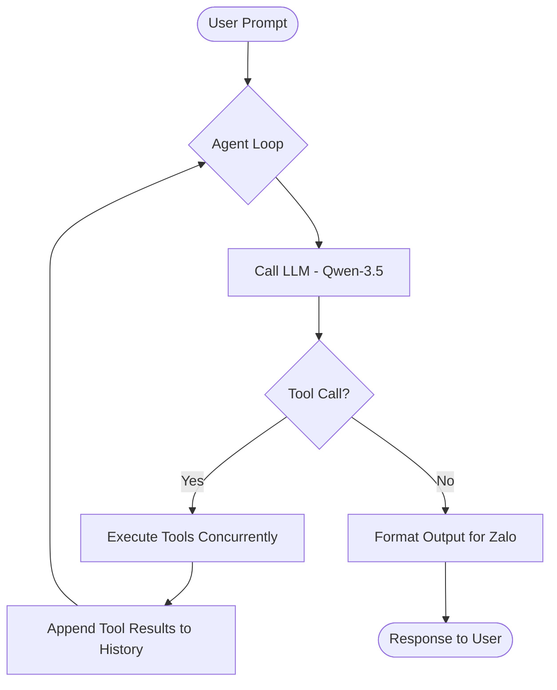
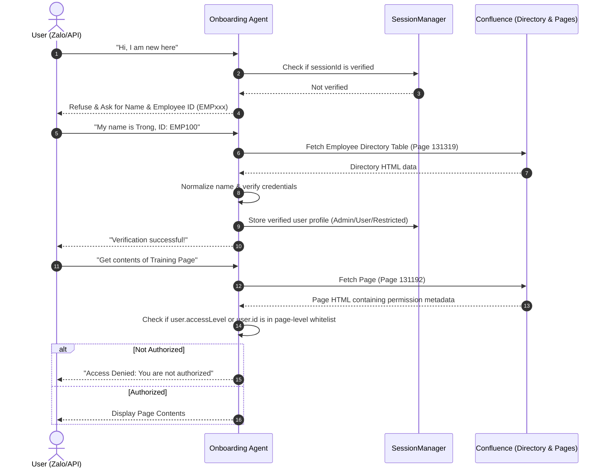

# 🏗️ Detailed Project Architecture & Structure

This document provides a comprehensive breakdown of the AI Onboarding Assistant's system architecture, codebase layout, extension mechanisms, and runtime flows.

---

## 📂 Codebase Directory Layout

```
.
├── .agentbase/              # AgentBase configuration and operational hooks
├── .agents/                 # AI coding agent workflows and developer skills
├── assets/
│   └── thumbnail.png        # Project banner / thumbnail
├── docs/
│   └── STRUCTURE.md         # Detailed architectural documentation (this file)
├── plans/                   # Historical roadmap and implementation plans
├── src/
│   ├── cli/                 # Interactive command-line (CLI) interfaces
│   ├── controllers/         # Web controller layer (Express request handling)
│   ├── core/                # Core Agent runtime and abstractions
│   │   ├── agent.ts         # Agent multi-step reasoning loop (runAgent)
│   │   ├── client.ts        # Anthropic API client initialization
│   │   ├── registry.ts      # Registry for dynamic Skills and Tools load
│   │   ├── session.ts       # Chat sessions & user verification state management
│   │   └── types.ts         # Core TypeScript type definitions
│   ├── services/            # Integrations with external services
│   │   ├── atlassian.ts     # Client services for Jira & Confluence Cloud REST APIs
│   │   ├── memory.ts        # Long-term memory store service (preferences)
│   │   └── zalo.ts          # Zalo Bot event listening, webhooks & responses
│   ├── skills/              # Modular Agent capabilities (Persona + Tools)
│   │   ├── artifacts/       # Workspace file and document management
│   │   ├── atlassian/       # Atlassian integration tools & employee directory lookup
│   │   ├── memory/          # Personalized user preference storage
│   │   ├── system/          # Basic system utility tools
│   │   └── index.ts         # Skills bootstrap/registration loader
│   ├── tools/               # Agent tool definition aggregates
│   ├── utils/               # Common helper functions (formatting, env, etc.)
│   ├── server.ts            # Web Server entrypoint
│   └── index.ts             # CLI Mode entrypoint
├── package.json             # Scripts, dependencies, and configuration
├── tsconfig.json            # TypeScript configuration
└── Dockerfile               # Production containerization configuration
```

---

## ⚙️ Core Agent Architecture

The agent is designed using a **modular, decoupled architecture** built on top of the `@anthropic-ai/sdk` and powered by the `qwen/qwen3-5-27b` model on the **VNG Cloud MaaS AI Platform**.

### 1. Dynamic System Prompts & Tools
Rather than having a static configuration, the system prompt and available tools are assembled dynamically at runtime:
- **Base Persona**: Set via environment variables.
- **Skills Registry**: The [SkillsRegistry](file:///Users/duongductrong/Developer/zlp/claw26-team210/src/core/registry.ts) holds all active skills. Each skill appends its own persona guidelines to the main system prompt and registers its tools.
- **Session Context**: Once a user is verified, their profile information (Name, Role, Access Level) is injected directly into the active system prompt.

### 2. Multi-step Execution Loop
When a message is sent to [runAgent](file:///Users/duongductrong/Developer/zlp/claw26-team210/src/core/agent.ts#L11), it executes a loop with a maximum of 5 steps:
1. Calls the LLM with the consolidated system prompt, conversation history, and active tools.
2. If the model chooses to call tools, the agent executes them concurrently.
3. Tool results are appended back into the message history.
4. The loop repeats until the model decides to respond with a final text block rather than calling more tools.



---

## 🔐 Security & Access Control Flow

The assistant implements a strict **Zero-Trust Security & Role-Based Access Control (RBAC)** flow:



---

## 🛠️ Registered Skills & Tools Catalog

### 1. `system` (System Utilities)
- `getSystemTime`: Returns the current server time and date.

### 2. `atlassian` (Atlassian Integrations)
- `verifyEmployee`: Verifies user identity against the directory table stored on Confluence Page `131319`.
- `jiraGetIssue`: Retrieves specific issue details by Jira key.
- `jiraCreateIssue`: Creates new Jira issues (Bugs, Tasks, Stories).
- `confluenceGetPage`: Retrieves page details and enforces page-level access control.
- `confluenceSearchPages`: Performs keyword search inside Confluence space and filters unauthorized pages.
- `confluenceListPages`: Lists all pages in the workspace while filtering unauthorized entries.
- `confluenceCreatePage`: Creates a new Confluence page.

### 3. `artifacts` (Workspace Artifacts)
- `createOrUpdateArtifact`: Writes/updates documents inside the server's workspace.
- `readArtifact`: Reads local files.
- `listArtifacts`: Lists all files managed in the workspace.

### 4. `memory` (User Preferences)
- `saveUserPreference`: Saves user habits/facts into the long-term memory store.
- `getUserPreferences`: Retrieves preferences to personalize interactions.
